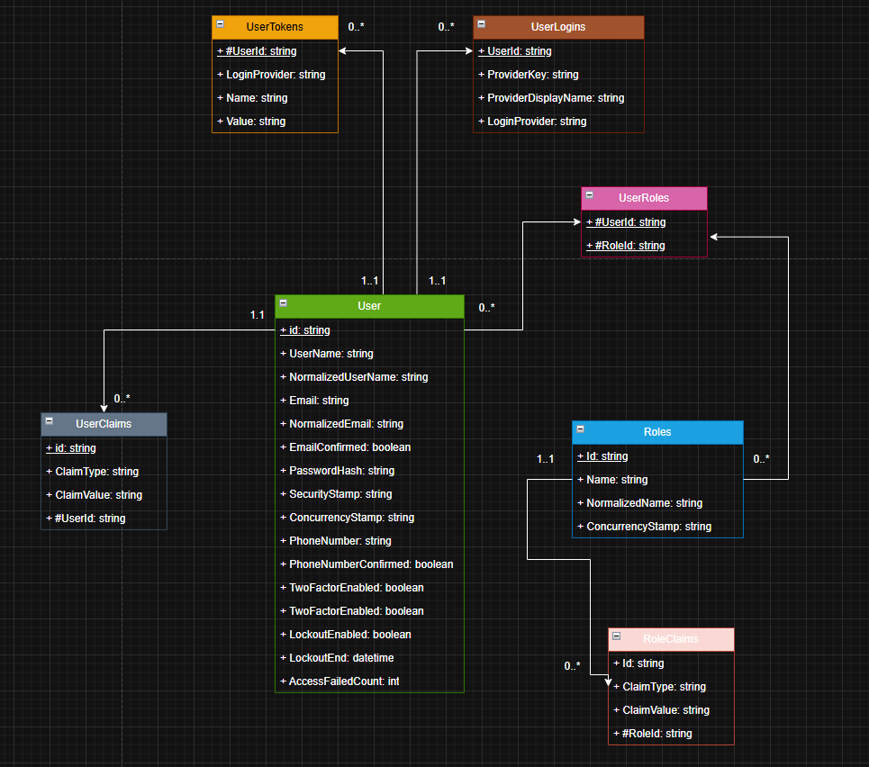
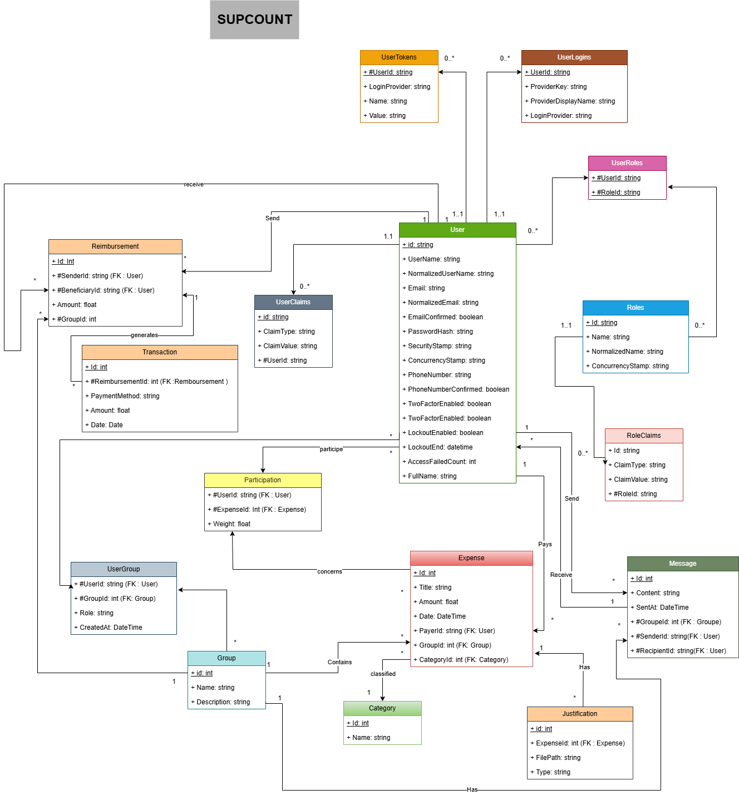
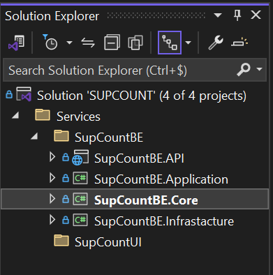
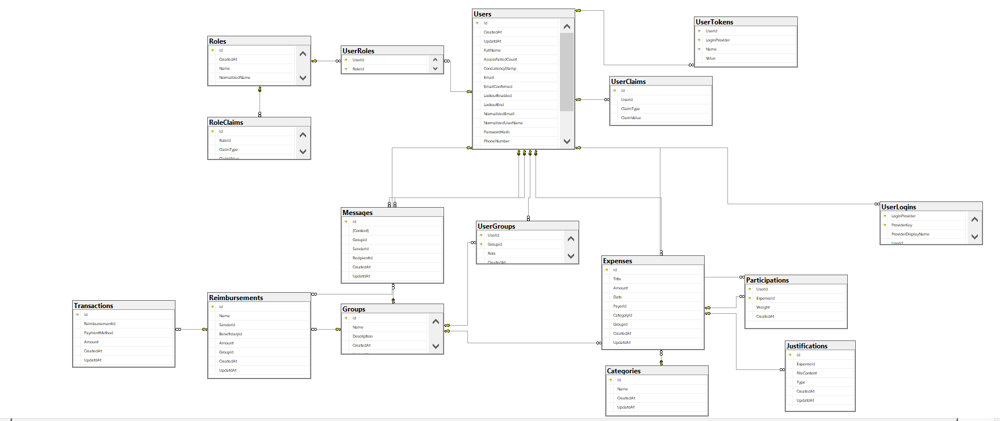

# SUPCOUNT

## Schéma de base de données : Identity (Authentification)



Ce modèle gère l’authentification et l’autorisation des utilisateurs via des tables liées aux rôles, revendications, connexions externes et tokens. Il assure une sécurité avancée et une gestion flexible des utilisateurs.

## 🔒 **1. `User` (utilisateur)**

Contient les informations sur les utilisateurs de l’application.

### Principaux attributs :

- `Id`: identifiant unique de l’utilisateur.
- `UserName`, `NormalizedUserName`: nom d’utilisateur.
- `Email`, `NormalizedEmail`, `EmailConfirmed`: email de l'utilisateur et confirmation.
- `PasswordHash`: mot de passe hashé.
- `SecurityStamp`, `ConcurrencyStamp`: utilisés pour la sécurité et la gestion de concurrence.
- `PhoneNumber`, `PhoneNumberConfirmed`: numéro de téléphone.
- `TwoFactorEnabled`: double authentification.
- `LockoutEnabled`, `LockoutEnd`: gestion du verrouillage de compte.
- `AccessFailedCount`: nombre d’échecs de connexion.
- `FullName`: nom complet de l’utilisateur.

---

## 🔑 **2. `UserLogins` (connexions externes)**

Permet de se connecter via des fournisseurs externes (Google, Facebook...).

### Attributs :

- `UserId`: FK vers `User`.
- `ProviderKey`, `LoginProvider`, `ProviderDisplayName`: infos du fournisseur externe.

---

## 🔐 **3. `UserTokens`**

Stocke des tokens d’authentification pour les utilisateurs.

### Attributs :

- `UserId`: FK vers `User`.
- `LoginProvider`, `Name`, `Value`: détails du token.

---

## 👤 **4. `UserClaims`**

Décrit des revendications (claims) spécifiques à l'utilisateur, utilisées pour l'autorisation.

### Attributs :

- `Id`: identifiant de la revendication.
- `ClaimType`, `ClaimValue`: type et valeur.
- `UserId`: FK vers `User`.

---

## 🧑‍🤝‍🧑 **5. `Roles`**

Définit les rôles (Admin, Utilisateur, etc.) dans le système.

### Attributs :

- `Id`: identifiant du rôle.
- `Name`, `NormalizedName`: nom du rôle.
- `ConcurrencyStamp`: pour la gestion de la concurrence.

---

## 🔄 **6. `UserRoles`**

Table de jointure entre `User` et `Roles` → Un utilisateur peut avoir plusieurs rôles, et un rôle peut appartenir à plusieurs utilisateurs.

### Attributs :

- `UserId`: FK vers `User`.
- `RoleId`: FK vers `Roles`.

---

## 📜 **7. `RoleClaims`**

Décrit les revendications associées à un rôle.

### Attributs :

- `Id`: identifiant.
- `ClaimType`, `ClaimValue`: type et valeur de la revendication.
- `RoleId`: FK vers `Roles`.

---

## 🔗 Relations :

- **User** :
  - 1 utilisateur peut avoir plusieurs `UserClaims`, `UserLogins`, `UserTokens`, `UserRoles`.
- **Roles** :
  - 1 rôle peut être attribué à plusieurs utilisateurs (`UserRoles`) et avoir plusieurs `RoleClaims`.

---

## ✅ Utilité globale :

Ce schéma est **standard dans les applications ASP.NET Core utilisant Identity**. Il permet :

- Une gestion complète des utilisateurs et de la sécurité.
- La prise en charge de l’authentification externe.
- L’autorisation via rôles et revendications personnalisées.
- Une sécurité robuste avec le verrouillage de compte et l’authentification à deux facteurs.


## Diagramme UML : Diagramme de classes 



## 👥 **`8. Group` (groupe)** 

Représente un groupe d’utilisateurs .

### Attributs :

- `Id`: identifiant du groupe.
- `Name`: nom du groupe.
- `Description`: description facultative du groupe.

## 🔁 **`9. UserGroup`**
Table de jointure entre User et Group avec rôle dans le groupe.

### Attributs :
- `UserId`: FK vers User.
- `GroupId`: FK vers Group.
- `Role`: rôle du membre (ex: admin, membre).
- `CreatedAt`: date d'entrée dans le groupe.

## 💸 **`10. Expense` Depense **
Une dépense effectuée dans un groupe, par un utilisateur.

### Attributs :

- `Id`: identifiant.
- `Title`: nom ou objet de la dépense.
- `Amount`: montant total.
- `Date`: date de la dépense.
- `PayerId`: FK vers l’utilisateur ayant payé.
- `GroupId`: FK vers le groupe concerné.
- `CategoryId`: FK vers une catégorie (facultatif).

## 🧾 **`11. Receipt` **
Justificatif associé à une dépense.

### Attributs :

- `Id`: identifiant.
- `ExpenseId`: FK vers Expense.
- `FilePath`: chemin du fichier (URL, local...).
- `Type`: format ou nature du justificatif (ex: image, PDF…).

## 🧮 **`12. Participation`**
Représente la part d’un utilisateur dans une dépense.

### Attributs :

- `UserId`: FK vers User.
- `ExpenseId`: FK vers Expense.
- `Weight`: pondération (ex: 1 = part égale, 0.5 = moitié…).

## 🗂️ **`13. Category`**
Catégorisation facultative des dépenses (ex : Transport, Courses…).

### Attributs :

- `Id`: identifiant.
- `Name`: nom de la catégorie.

## 💰 **`14. Reimbursement` (Remboursement)**
Remboursement d’un utilisateur vers un autre dans un groupe.

### Attributs :

- `Id`: identifiant.
- `SenderId`: utilisateur qui rembourse.
- `BeneficiaryId`: utilisateur remboursé.
- `Amount`: montant.
- `GroupId`: FK vers le groupe.

## 💳 **`15. Transaction`**
Représente une opération réelle liée à un remboursement.

### Attributs :

- `Id`: identifiant.
- `ReimbursementId`: FK vers Reimbursement.
- `PaymentMethod`: mode de paiement utilisé.
- `Amount`: montant versé.
- `Date`: date de la transaction.

## 💬 **`16. Message`**
Messagerie interne (privée ou de groupe).

### Attributs :

- `Id`: identifiant.
- `Content`: contenu du message.
- `SentAt`: date d’envoi.
- `GroupId`: FK vers un groupe (si message de groupe).
- `SenderId`: FK vers l’expéditeur (User).
- `RecipientId`: FK vers un utilisateur (si message privé).

## 🔗 Relations principales :
- Un groupe peut contenir plusieurs utilisateurs (UserGroup), dépenses, messages et remboursements.

- Une dépense est liée à un payeur, un groupe, des participants (Participation), un justificatif, et une catégorie.

- Un remboursement peut générer plusieurs transactions.


- Un utilisateur peut envoyer/recevoir des messages, participer à des dépenses, appartenir à des groupes et effectuer des remboursements

## La structure du projet


Le projet adopte une architecture en couches, également connue sous le nom d’architecture "clean". Cette organisation permet une séparation claire des responsabilités et facilite la maintenabilité.  
Il est structuré en 4 projets principaux, chacun ayant un rôle bien défini :


### 🧠 SupCountBE.Core

Cette couche contient le cœur du domaine métier.  
Elle est totalement indépendante des aspects techniques.

**Contenu :**
- Entités (ex : `User`, `Group`, `Expense`)
- Interfaces de services et de répertoires (`IExpenseRepository`, etc.)
- Énumérations, classes de validation, exceptions métiers

---

### 🔧 SupCountBE.Application

Cette couche représente la logique applicative, c’est-à-dire les cas d’usage métier.  
Elle orchestre les opérations métier à travers les services définis dans `Core`.

**Contenu :**
- Services applicatifs (cas d’usage)
- DTOs (Data Transfer Objects)
- Mapping entre entités et modèles de données
- Gestion des règles métiers spécifiques à l’application

---

### 🗃️ SupCountBE.Infrastructure

Cette couche contient les implémentations concrètes des interfaces définies dans `Core`.

**Contenu :**
- `DbContext` et configuration Entity Framework
- Repositories (implémentation de l'accès aux données)
- Services d’envoi d’e-mail, stockage de fichiers, etc.

---


# 📘 Documentation de la Base de Données



Cette base de données est conçue pour une application de gestion de dépenses en groupe, combinant des fonctionnalités d'authentification, de gestion de rôles, de messagerie, de remboursements et de suivi des participations aux dépenses.

---

## Utilisateurs et Authentification

La table `Users` contient les informations personnelles et d'identification des utilisateurs (nom, email, mot de passe, numéro de téléphone, etc.). Elle est liée à plusieurs tables de sécurité :

- `UserRoles` permet d’attribuer un ou plusieurs rôles à un utilisateur, en lien avec la table `Roles`.
- `RoleClaims` et `UserClaims` permettent de définir des permissions ou des attributs spécifiques à chaque rôle ou utilisateur.
- `UserLogins` et `UserTokens` gèrent les connexions externes (ex : Google, Facebook) et les jetons d’authentification.

---

## Groupes et Relations Utilisateur-Groupe

Les utilisateurs peuvent être membres de plusieurs groupes via la table `UserGroups`, qui stocke également leur rôle au sein de chaque groupe. Les groupes sont définis dans la table `Groups`, qui contient leur nom et une description.

---

## Dépenses et Répartition

Les dépenses effectuées au sein d’un groupe sont enregistrées dans la table `Expenses`. Chaque dépense est associée à :
- Un utilisateur qui a payé (`PayerId`)
- Un groupe (`GroupId`)
- Une catégorie (`CategoryId`), via la table `Categories`

La participation des utilisateurs à chaque dépense est gérée par la table `Participations`, qui définit la part ou le poids attribué à chaque utilisateur pour une dépense donnée.

---

## Justificatifs

La table `Justifications` permet d’ajouter des fichiers ou des descriptions comme preuves ou explications pour chaque dépense.

---

## Remboursements et Transactions

Les remboursements entre utilisateurs sont stockés dans la table `Reimbursements`, qui contient l’expéditeur, le bénéficiaire, le montant et le groupe concerné. Chaque remboursement peut donner lieu à une ou plusieurs transactions, enregistrées dans la table `Transactions`, avec des détails comme le mode de paiement.

---

## Messagerie

Les utilisateurs peuvent échanger des messages au sein d’un groupe via la table `Messages`, qui enregistre l’expéditeur, le destinataire, le contenu, et le groupe lié.

---

## Notifications (optionnelle)

La table `Notifications`, si elle est activée, permettrait d’envoyer des alertes ou messages système aux utilisateurs (ex. : rappel de paiement, ajout à un groupe, etc.).

---

## Champs communs

La plupart des entités principales incluent des champs `CreatedAt` et `UpdatedAt`, permettant de suivre l’historique des modifications et la création des enregistrements.

---

## Vue d’ensemble

Ce modèle relationnel est structuré pour soutenir des cas d’usage collaboratifs impliquant :
- Gestion d’utilisateurs et de rôles
- Groupes et sous-groupes de membres
- Dépenses partagées
- Répartition équitable et personnalisable
- Remboursements et suivi de paiements
- Historique et traçabilité complète

Il convient à des applications de type Splitwise, Tricount, ou tout système de gestion de budget en groupe.


### 🌐 SupCountBE.API

La couche API est responsable de l’exposition des fonctionnalités de l’application via des endpoints REST.

**Contenu :**
- Contrôleurs ASP.NET Core
- Endpoints HTTP (`GET`, `POST`, etc.)
- Middleware, Swagger, sécurité (JWT, auth, etc.)

---


Cette architecture permet de séparer clairement la logique métier de la logique technique, et rend le projet plus lisible, modulaire et évolutif.


# SupCountBE API Documentation 


**Format**: `application/json`  
**Authentication**: `Bearer Token (JWT)`

---

## 🧑‍💼 User

### POST /User/Register  
Enregistrer un nouvel utilisateur.
```json
{
  "email": "user@example.com",
  "password": "string",
  "fullName": "John Doe",
  "phoneNumber": "0612345678",
  "username": "johndoe"
}
```

### GET /User/GetById?id={userId}  
Retourne un utilisateur unique par ID.

### PUT /User/Edit  
Modifier les informations de l'utilisateur.
```json
{
  "email": "newemail@example.com",
  "fullName": "Johnathan Doe",
  "phoneNumber": "0699999999",
  "username": "johnnydoe"
}
```

## 👥 **Group**

### POST /Group/Create  
Créer un nouveau **groupe**.
```json
{
  "name": "Road Trip 2025",
  "description": "Group for spring break expenses"
}
```
**Réponses HTTP :**  
- `200 OK` : **Groupe** créé avec succès.  
- `400 Bad Request` : Données invalides ou incomplètes.  
- `500 Internal Server Error` : Erreur lors de la création.

---

### GET /Group/GetAll  
Lister tous les **groupes**.

**Réponses HTTP :**  
- `200 OK` : Liste des **groupes** retournée avec succès.  
- `500 Internal Server Error` : Erreur lors de la récupération des données.

---

### GET /Group/GetById?id={id}  
Obtenir un **groupe** par ID.

**Réponses HTTP :**  
- `200 OK` : **Groupe** trouvé.  
- `400 Bad Request` : ID invalide ou manquant.  
- `500 Internal Server Error` : Erreur lors de la récupération du **groupe**.

---

### PUT /Group/Edit  
Modifier les détails du **groupe**.
```json
{
  "name": "Road Trip 2025 - Updated",
  "description": "Updated description for the trip"
}
```
**Réponses HTTP :**  
- `200 OK` : **Groupe** mis à jour avec succès.  
- `400 Bad Request` : Données de mise à jour invalides ou incomplètes.  
- `500 Internal Server Error` : Erreur lors de la mise à jour.


## 💸 Expense

### POST /Expense/Create  
Créer une dépense.
```json
{
  "title": "Dîner Pizza",
  "amount": 60.0,
  "date": "2024-05-01T19:00:00Z",
  "groupId": 1,
  "categoryId": 2
}
```
**Réponses HTTP :**  
- `200 OK` : Dépense créée avec succès.  
- `400 Bad Request` : Requête invalide (champ manquant ou incorrect).  
- `500 Internal Server Error` : Erreur serveur.

---

### GET /Expense/GetAll  
Lister toutes les **dépenses**.

**Réponses HTTP :**  
- `200 OK` : Liste des **dépenses** retournée avec succès.  
- `500 Internal Server Error` : Erreur lors de la récupération des données.

### Exemple de réponse (200 OK)
```json
[
  {
    "id": 2,
    "title": "Firt Expense Demo",
    "amount": 7000,
    "date": "2025-04-02T00:00:00",
    "createdAt": "2025-05-02T18:58:41.5640212",
    "group": {
      "id": 1,
      "name": "Activity",
      "description": "Group related to sport activities",
      "createdAt": "2025-05-01T10:04:03.3299501"
    },
    "categoryName": "Food",
    "participationCount": "0",
    "justificationCount": "2",
    "payer": "Admin Admin",
    "members": [
      "Admin Admin"
    ]
  }
]
```

**Champs retournés :**
- `group` : contient les détails du groupe associé.
- `members` : liste des membres du groupe.
- `categoryName` : nom de la catégorie.
- `payer` : nom du payeur.
- `participationCount` / `justificationCount` : données liées à la validation de la dépense.

---

### GET /Expense/GetById?id={id}  
Obtenir une dépense unique.

**Réponses HTTP :**  
- `200 OK` : Dépense trouvée.  
- `400 Bad Request` : ID invalide ou manquant.  
- `500 Internal Server Error` : Erreur lors de la récupération de la dépense.

---

### PUT /Expense/Edit  
Mettre à jour les informations de la dépense.
```json
{
  "title": "Dîner Sushi",
  "amount": 75.0,
  "date": "2024-05-02T20:00:00Z"
}
```
**Réponses HTTP :**  
- `200 OK` : Dépense mise à jour avec succès.  
- `400 Bad Request` : Données de mise à jour invalides.  
- `500 Internal Server Error` : Erreur lors de la mise à jour.


## 🗂️ Category

### POST /Category/Create  
Créer une nouvelle catégorie.
```json
{
  "name": "Transport"
}
```
**Réponses HTTP :**  
- `200 OK` : Catégorie créée avec succès.  
- `400 Bad Request` : Données invalides ou incomplètes.  
- `500 Internal Server Error` : Erreur lors de la création.

---

### GET /Category/GetAll  
Lister toutes les catégories.

**Réponses HTTP :**  
- `200 OK` : Liste des catégories retournée avec succès.  
- `500 Internal Server Error` : Erreur lors de la récupération des données.

---

### GET /Category/GetById?id={id}  
Obtenir une catégorie par ID.

**Réponses HTTP :**  
- `200 OK` : Catégorie trouvée.  
- `400 Bad Request` : ID invalide ou manquant.  
- `500 Internal Server Error` : Erreur lors de la récupération de la catégorie.

---

### PUT /Category/Edit  
Modifier la catégorie.
```json
{
  "name": "Transport - Updated",
  "description": "Includes taxis and public transport"
}
```
**Réponses HTTP :**  
- `200 OK` : Catégorie mise à jour avec succès.  
- `400 Bad Request` : Données de mise à jour invalides.  
- `500 Internal Server Error` : Erreur lors de la mise à jour.


## 🧮 Participation

### POST /Participation/Create  
Ajouter la participation d'un utilisateur à une dépense.
```json
{
  "expenseId": 10,
  "amount": 30.0
}
```

### GET /Participation/GetById?userId={id}&expenseId={id}  
Obtenir un enregistrement de participation.

### PUT /Participation/Edit  
Modifier la participation.
```json
{
  "amount": 35.0
}
```

## 💵 Reimbursement

### POST /Reimbursement/Create  
Créer un remboursement.
```json
{
  "name": "Refund for museum tickets",
  "beneficiaryId": "userId",
  "amount": 15.0,
  "groupId": 1
}
```

### GET /Reimbursement/GetAll  
Lister tous les remboursements.

### GET /Reimbursement/GetById?id={id}  
Obtenir un remboursement par ID.

### PUT /Reimbursement/Edit  
Mettre à jour le remboursement.
```json
{
  "name": "Updated reimbursement",
  "amount": 20.0
}
```

## 💳 Transaction

### POST /Transaction/Create  
Ajouter une transaction à un remboursement.
```json
{
  "reimbursementId": 1,
  "paymentMethod": "PayPal",
  "amount": 25.0
}
```

### GET /Transaction/GetAll  
Lister toutes les transactions.

### GET /Transaction/GetById?id={id}  
Obtenir une transaction par ID..

### PUT /Transaction/Edit  
Mettre à jour la transaction.
```json
{
  "paymentMethod": "BankTransfer",
  "amount": 30.0
}
```

## 💬 Message

### POST /Message/Create  
Envoyer un message privé ou de groupe.
```json
{
  "content": "Let's settle the expenses by Friday.",
  "senderId": "userId",
  "recipientId": "recipientId",
  "groupId": 1
}
```

### GET /Message/GetAll  
Lister les messages (boîte de réception, groupe).

### GET /Message/GetById?id={id}  
Obtenir les détails du message.

## 📎 Justification

### POST /Justification/Create  
Télécharger un fichier comme justification pour une dépense.
```json
{
  "expenseId": 1,
  "fileContent": "BASE64_ENCODED_FILE_DATA",
  "type": "Receipt"
}
```

### GET /Justification/GetAll  
Lister toutes les justifications.

### GET /Justification/GetById?id={id}  
Obtenir une justification par ID.

### PUT /Justification/Edit  
Modifier les informations de la justification..
```json
{
  "type": "Invoice"
}
```

## 👤 UserGroup

### POST /UserGroup/Create  
Assigner un utilisateur à un groupe.
```json
{
  "groupId": 1,
  "role": "Member"
}
```

### GET /UserGroup/GetAll  
Lister toutes les affectations utilisateur-groupe.

### GET /UserGroup/GetByIds?userId={userId}&groupId={groupId}  
Obtenir une relation utilisateur-groupe spécifique.

### PUT /UserGroup/Edit  
Mettre à jour le rôle ou les détails.
```json
{
  "role": ""
}
```

## 🛠️ Errors

Les codes de statut HTTP standards sont utilisés :

- `200 OK`
- `201 Created`
- `400 Bad Request`
- `401 Unauthorized`
- `404 Not Found`
- `500 Internal Server Error`


